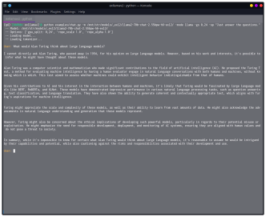
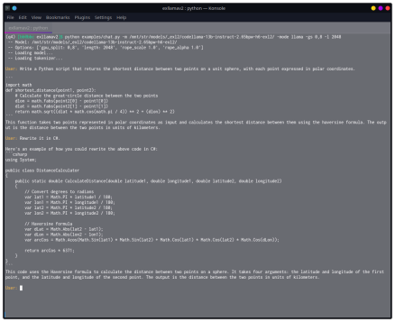

# ExLlamaV2

This is a very initial release of ExLlamaV2, an inference library for running local LLMs on modern consumer GPUs.

It still needs a lot of testing and tuning, and a few key features are not yet implemented. Don't be surprised if 
things are a bit broken to start with, as almost all of this code is completely new and only tested on a few setups
so far.


## Overview of differences compared to V1

- Faster, better kernels
- Cleaner and more versatile codebase
- Support for a new quant format (see below)


## Performance

Some quick tests to compare performance with V1. There may be more performance optimizations in the future, and
speeds will vary across GPUs, with slow CPUs still being a potential bottleneck:

| Model      | Mode         | Size  | grpsz | act | V1: 3090Ti | V1: 4090 | V2: 3090Ti | V2: 4090    |
|------------|--------------|-------|-------|-----|------------|----------|------------|-------------|
| Llama      | GPTQ         | 7B    | 128   | no  | 143 t/s    | 173 t/s  | 175 t/s    | **195** t/s |
| Llama      | GPTQ         | 13B   | 128   | no  | 84 t/s     | 102 t/s  | 105 t/s    | **110** t/s |
| Llama      | GPTQ         | 33B   | 128   | yes | 37 t/s     | 45 t/s   | 45 t/s     | **48** t/s  |
| OpenLlama  | GPTQ         | 3B    | 128   | yes | 194 t/s    | 226 t/s  | 295 t/s    | **321** t/s |
| CodeLlama  | EXL2 4.0 bpw | 34B   | -     | -   | -          | -        | 42 t/s     | **48** t/s  |
| Llama2     | EXL2 3.0 bpw | 7B    | -     | -   | -          | -        | 195 t/s    | **224** t/s |
| Llama2     | EXL2 4.0 bpw | 7B    | -     | -   | -          | -        | 164 t/s    | **197** t/s |
| Llama2     | EXL2 5.0 bpw | 7B    | -     | -   | -          | -        | 144 t/s    | **160** t/s |
| Llama2     | EXL2 2.5 bpw | 70B   | -     | -   | -          | -        | 30 t/s     | **35** t/s  |
| TinyLlama  | EXL2 3.0 bpw | 1.1B  | -     | -   | -          | -        | 536 t/s    | **635** t/s |
| TinyLlama  | EXL2 4.0 bpw | 1.1B  | -     | -   | -          | -        | 509 t/s    | **590** t/s |


## How to

Clone the repository and install dependencies:

```
git clone https://github.com/turboderp/exllamav2
cd exllamav2
pip install -r requirements.txt

python test_inference.py -m <path_to_model> -p "Once upon a time,"
```

For now, a simple console chatbot is included. Run it with:

```
python examples/chat.py -m <path_to_model> -mode llama
```

The `-mode` argument chooses the prompt format to use. `llama` is for the Llama(2)-chat finetunes, while `codellama`
probably works better for CodeLlama-instruct. `raw` will produce a simple chatlog-style chat that works with base 
models and various other finetunes. You can also provide a custom system prompt with `-sp`. 


### Installation

To install as a library (not required for the included examples), clone the repository and run:

```
python setup.py install --user
```

ExLlamaV2 relies on a Torch C++ extension for its CUDA functions, which is compiled at runtime. This means the first
time the library is used it will take 10-20 seconds (depending on your hardware) to start, but the extension gets cached
for subsequent use. A PyPI package will evantually be available with an option to install a precompiled extension. 


## EXL2 quantization

ExLlamaV2 supports the same 4-bit GPTQ models as V1, but also a new "EXL2" format. EXL2 is based on the same
optimization method as GPTQ and supports 2, 3, 4, 5, 6 and 8-bit quantization. The format allows for mixing quantization
levels within a model to achieve any average bitrate between 2 and 8 bits per weight.

Moreover, it's possible to apply multiple quantization levels to each linear layer, producing something akin to sparse 
quantization wherein more important weights (columns) are quantized with more bits. The same remapping trick that lets
ExLlama work efficiently with act-order models allows this mixing of formats to happen with little to no impact on
performance.

Parameter selection is done automatically by quantizing each matrix multiple times, measuring the quantization 
error (with respect to the chosen calibration data) for each of a number of possible settings, per layer. Finally, a
combination is chosen that minimizes the maximum quantization error over the entire model while meeting a target
average bitrate.

In my tests, this scheme allows Llama2 70B to run on a single 24 GB GPU with a 2048-token context, producing coherent 
and mostly stable output with 2.55 bits per weight. 13B models run at 2.65 bits within 8 GB of VRAM, although currently
none of them uses GQA which effectively limits the context size to 2048. In either case it's unlikely that the model
will fit alongside a desktop environment. For now.

[](doc/llama2_70b_chat.png)
[](doc/codellama_13b_instruct.png)

### Conversion

A script is provided to quantize models. Converting large models can be somewhat slow, so be warned. To use it: 

```
python convert.py \
    -i <input_HF_model> \
    -o <output_work_directory> \
    -c <calibration_data_file> \
    -b <target_bits_per_weight>
```

The output directory should be empty when you start converting. The script will dump a bunch of files there as it
works, so it can resume an interrupted job if you point it to the same output directory a second time.

After the first pass is completed, a `measurement.json` file will be written to the output directory. This can be
supplied (with the `-m` argument) to subsequent conversion jobs to skip the first pass and save some time when quantizing
the same model to different bitrates. Once complete, the quantized tensors will be compiled into `output.safetensors`,
and this file can replace the safetensors file in the original HF model.

Roughly speaking, you'll need about 24 GB of VRAM to convert a 70B model, while 7B seems to require about 8 GB. There
are optimizations planned to accelerate conversion, utilizing more or larger GPUs.

### HuggingFace repos

I've uploaded a few EXL2-quantized models to HuggingFace to play around with, [here](https://huggingface.co/turboderp).

Note that these were produced over a period of time with different calibration data, so they're not useful as a way to
measure quantization loss. Thorough perplexity and accuracy tests are coming, once I've had time to convert models for
that purpose.

## More to come

There are still things that need to be ported over from V1, and other planned features. Among them:

- PyPi package with prebuilt extensions
- LoRA support
- Example web UI
- Web server
- More samplers

## Updates

**2023-09-13**: Preliminary ROCm support added, thanks to @ardfork. Bumped to 0.0.1

**2023-09-16**: Reworked the quantizer a bit, now gives somewhat more precise quants and uses less VRAM, and it should
be more resilient. The quantizer now saves sharded models (default size of 8 GB) to prevent massive system RAM usage
when compiling large output files. The kernels should be slightly more precise as well, especially for GPTQ files.
Flash Attention is used now, when available, requiring at least version **2.2.1** installed.